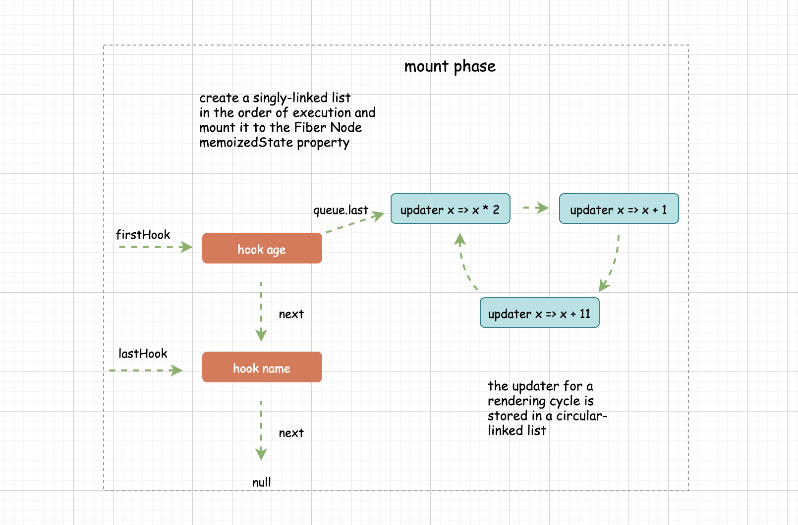

## react-useState中链表结构实现 ##

hooks利用的是单向链表结构存储

hooks的数据结构如下:
```javascript
const hook = {
  // 当前hook的值
  memoizedState: any;
  // 指向下一个hook
  next: hook;
}
```

```javascript
function TestUseState() {
  const [count, setCount] = useState(1);
  const [name, setName] = useState('rocky');
  return [setCount, setName];
}
// 对应的hooks链表结构应该是
const hooks = {
  memoizedState: 1,
  next: {
    memoizedState: 'rocky',
    next: null
  }
}
```

下面看如何实现hooks链表
```javascript


// 存储第一个hook
let firstHook = null;
// 存储最后一个hook
let lastHook = null;
// 首次渲染完成
let mounted = false;
// 当前正在执行计算的 hook
let currentUpdateHook = null;

// 创建hooks链表方法
function createHookLinked() {
  const hook = {
    memoizedState: null,
    next: null,
  };
  // 第一次
  if (lastHook === null) {
    firstHook = lastHook = hook;
  } else {
    lastHook = lastHook.next = hook;
  }

  return lastHook;
}


// 最后一个updater，也就是最新的那个
interface queue {
  last: updater;
}

// updater
interface updater {
  action: Function | any; // 更新函数
  next: updater; // 下一个updater
}

function dispatchAction(queue, action) {
  const updater = { action, next: null };
  const last = queue.last;
  // 第一次链表为空，将当前更新作为第一个，并将next指向自己，环状链表
  if (last === null) {
    updater.next = updater;
  } else {
    // 这里的操作是在环状链表中添加一个节点，并且继续保持环状

    const first = last.next;
    // 如果first !== null 说明是环状
    if (first !== null) {
      // 1.最新的updater对象的next指向前一个，前一个就是环状链表的第一个节点
      updater.next = first;
    }
    // 2.再把最后一个updater的next指向新加入的updater，这样和上面1 首尾就链接起来构成新的环状链表了
    last.next = updater;
  }
  // 将queue的last指向最新的updater对象上，queue.last永远指向最后一个updater
  queue.last = updater;
}


// 更新state
function updateState() {
  if (currentUpdateHook === null) {
    currentUpdateHook = firstHook;
  }
  const queue = currentUpdateHook.queue;
  const last = queue.last;
  let first = last !== null ? last.next : null;

  let newState = currentUpdateHook.memoizedState;

  if (first !== null) {
    let update = first;
    do {
      // 执行每一次更新，去更新状态
      const action = update.action;
      // 函数则调用
      if (typeof action === 'function') {
        newState = action(newState);
      } else {
        newState = action;
      }
      update = update.next;
    } while (update !== null && update !== first);
  }

  currentUpdateHook.memoizedState = newState;
  // 关键代码，执行一轮调用之后要把更新队列清空，在下一轮的调用中重新添加队列
  queue.last = null;
  // 一个组件执行完成后，currentUpdateHook.next指向的是null 后面没有hook了
  currentUpdateHook = currentUpdateHook.next;

  const dispatch = queue.dispatch;

  // 返回最新的状态和修改状态的方法
  return [newState, dispatch];
}

function useState(initialState) {

  if (mounted) {
    return updateState();
  }

  const hook = createHookLinked();
  hook.memoizedState = initialState;

  const queue = hook.queue = {
    last: null,
    dispatch: null,
  };

  const dispatcher = queue.dispatch = dispatchAction.bind(null, queue);

  return [hook.memoizedState, dispatcher];
}
```

借用一张图来看看整体结构


hooks为什么不能用if 看下面代码：
```javascript
  let mounted = false;
  function App() {
    if(!mounted){
      const [name,setName] = useState('aaa');
      const [age,setAge] = useState(1);
      mounted = true;
    }
    const [str,setStr] = useState('str');

    console.log(str);

    return <div onClick={()=>setName('hello')}>点击<div>
  }

```
// 点击按钮的时候consoe.log输出的不是'str',而是'hello'
// 调用setName的时候，整个函数会重新执行，但是判断不会走useState('aaa')和useState(1)，不会重新取值了， 直接取str从链表的memoizedState字段取值
// 看代码98行，因为从第一个hook开始取值，所以就把name=hello取出来了。
